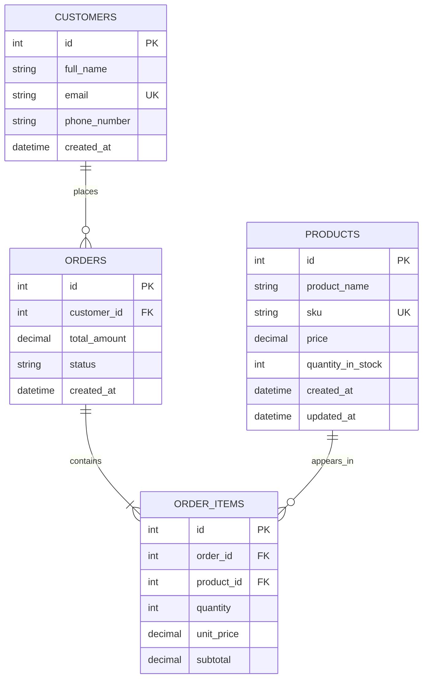

# ER Diagram

```mermaid
erDiagram
    CUSTOMERS ||--o{ ORDERS : places
    ORDERS ||--|{ ORDER_ITEMS : contains
    PRODUCTS ||--o{ ORDER_ITEMS : appears_in

    CUSTOMERS {
        int id PK
        string full_name
        string email UK
        string phone_number
        datetime created_at
    }

    PRODUCTS {
        int id PK
        string product_name
        string sku UK
        decimal price
        int quantity_in_stock
        datetime created_at
        datetime updated_at
    }

    ORDERS {
        int id PK
        int customer_id FK
        decimal total_amount
        string status
        datetime created_at
    }

    ORDER_ITEMS {
        int id PK
        int order_id FK
        int product_id FK
        int quantity
        decimal unit_price
        decimal subtotal
    }
```

